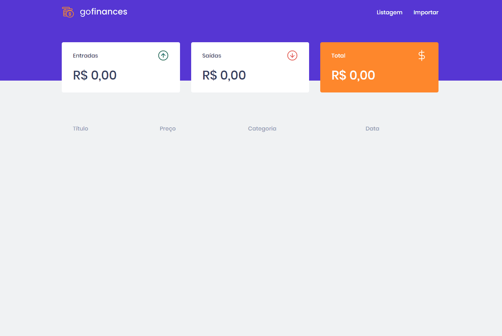

<h1 align="center">

   Web
</h1>

<br>

## :camera: Demonstração



##  🚀  Tecnologias

Esse projeto foi desenvolvido com as seguintes tecnologias:

- [Node.js](https://nodejs.org/)
- [ReactJS](https://reactjs.org/)
- [TypeScript](https://www.typescriptlang.org/)
- [TypeORM](https://typeorm.io/#/)
- [Express](https://expressjs.com/pt-br/)
- [PostgreSQL](https://www.postgresql.org/)
- [SuperTest](https://github.com/visionmedia/supertest)
- [React Router DOM](https://reacttraining.com/react-router/)
- [React Navigation](https://reactnavigation.org/)
- [React Icons](https://react-icons.netlify.com/#/)
- [Styled Components](https://styled-components.com/)
- [Axios](https://github.com/axios/axios)
- [Eslint](https://eslint.org/)
- [Prettier](https://prettier.io/)
- [EditorConfig](https://editorconfig.org/)

## 💻 Projeto

<p>Neste desafio deverá ser desenvolvida uma aplicação de gestao de transações, a GoFinances, para praticar tudo o que foi aprendido ate agora com React.js e Typescript, utilizando rotas e envio de arquivos por formulário.
Esta aplicação irá se conectar com o backend do <a href="https://github.com/igortuag/desafio-nodejs-typeorm-upload">desafio 06</a>.</p>

## Funcionalidades da aplicação

- Exibir uma listagem de todas as transações que estão cadastradas na sua API.
- Exibir o balance que é retornado do seu backend, contendo o total geral, junto ao total de entradas e saídas.
- Permitir o envio de um arquivo no formato csv para o seu backend, que irá fazer a importação das transações para o seu banco de dados.

## Layout da aplicação

O layout pode ser acessado através da página do Figma, no <a href="https://www.figma.com/file/EgOhyj1Inz14dhWGVhRlhr/GoFinances?node-id=1%3A863">seguinte link</a>.

## ⚙ Configuração

```bash
# Starting from the project root folder, go to frontend folder
$ cd web

# Install the dependencies
$ yarn

# Be sure the file 'src/services/api.ts' have the IP to your API

# Start the client
$ yarn start
```

## 📝 License

This project is licensed under the MIT License - see the [LICENSE](LICENSE) file for details.

---

Made with 💜 by Igor Tuag 👋 [See my linkedin](https://www.linkedin.com/in/igortuag)
